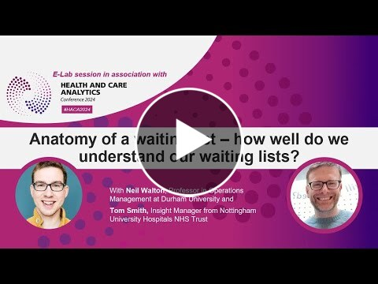

<!-- README.md is generated from README.Rmd. Please edit that file -->

# NHSRwaitinglist

<a alt="NHS-R Community's logo" href='https://nhsrcommunity.com/'></a>

<!-- badges: start -->

[](#contributors-)
[](https://lifecycle.r-lib.org/articles/stages.html#experimental)
[](https://github.com/nhs-r-community/NHSRwaitinglist/actions/workflows/R-CMD-check.yaml)
[](https://app.codecov.io/gh/nhs-r-community/NHSRwaitinglist?branch=main)
<!-- badges: end -->

{NHSRwaitinglist} is an R package implementing the waiting list
management approach described in the paper [Understanding Waiting Lists
Pressures](https://www.medrxiv.org/content/10.1101/2022.08.23.22279117v1)
by Fong et al. The methodology is presented by Neil Walton, Professor in
Operations Management at Durham University Business School. The package
is being contributed to by members of the [NHS-R
Community](https://nhsrcommunity.com/), with the aim of making it
simpler for NHS analysts to adopt these methods for the analysis of
their own waiting lists.

## Explanatory Videos

These videos explain more about the Operations Management methodologies
which are encapsulated by the package. Click through to view them on
YouTube.

| Detailed presentation of method | Recap of method, and presentation of this package |
|:--:|:--:|
| [](https://www.youtube.com/watch?v=NWthhW5Fgls) | [](https://www.youtube.com/watch?v=3peqTEl_ZAQ) |
| Midlands Analyst Network Huddle, Nov 2023 | Health and Care Analytics Conference e-lab, Jul 2024 |

## Installation

You can install the current version of {NHSRwaitinglist} from GitHub as
below.  
If you have not installed from GitHub before, you may first need to
create and store a “Personal Access Token” (PAT) to grant access to your
account, for example by following the [{usethis}
guide](https://usethis.r-lib.org/articles/git-credentials.html#get-a-personal-access-token-pat).

``` r
# install.packages("remotes")
remotes::install_github("nhs-r-community/NHSRwaitinglist", build_vignettes = TRUE)
```

## Getting Started

There is a minimal example below. To look in more detail at the
functions within the package and some more ways of using them, it is a
good idea to review the first two vignettes:

1.  The [example
    walkthrough](https://nhs-r-community.github.io/NHSRwaitinglist/articles/example_walkthrough.html)
    vignette takes a step-by-step walk through the white paper, using
    the six core functions in this package.  
2.  The [three example waiting
    lists](https://nhs-r-community.github.io/NHSRwaitinglist/articles/three_example_waiting_lists.html)
    vignette simulates three closely related waiting lists, and uses
    package functions to explore some of their characteristics.

At its most basic, the package can be used to simulate a waiting list (a
dataframe of waiting list addition dates and removal dates), and then
compute some important statistics. Of course, if you already have
waiting list data ready to analyse, you can skip the simulation step in
the code below.

``` r
# load the package
library(NHSRwaitinglist)

# simulate a waiting list
waiting_list <- wl_simulator(
  start_date = "2020-01-01",
  end_date = "2024-03-31",
  demand = 10, # simulating 10 patient arrivals per week
  capacity = 10.2 # simulating 10.2 patients being treated per week
)

# compute some waiting list statistics
overall_stats <- wl_stats(
  waiting_list = waiting_list,
  target_wait = 18 # standard NHS 18wk target
)

# review the minimal dataset needed to define a waiting list (first 5 rows only)
knitr::kable(head(waiting_list, 5))
```

| Referral   | Removal    |
|:-----------|:-----------|
| 2020-01-02 | 2020-01-03 |
| 2020-01-03 | 2020-01-04 |
| 2020-01-04 | 2020-01-05 |
| 2020-01-04 | 2020-01-06 |
| 2020-01-06 | 2020-01-07 |

``` r

# review the waiting list statistics
knitr::kable(overall_stats)
```

| mean_demand | mean_capacity | load | load_too_big | count_demand | queue_size | target_queue_size | queue_too_big | mean_wait | cv_arrival | cv_removal | target_capacity | relief_capacity | pressure |
|---:|---:|---:|:---|---:|---:|---:|:---|---:|---:|---:|---:|:---|---:|
| 9.818065 | 10.08372 | 0.9736549 | FALSE | 2174 | 5 | 44.18129 | FALSE | 1.8 | 1.131775 | 0.7003787 | 10.01489 | NA | 0.2 |

## Contributing

If you want to learn more about this project, please join the discussion
at the [NHS-R Community
Slack](https://nhsrway.nhsrcommunity.com/community-handbook.html#slack)
group and the specific channel \#managing-waiting-lists.

Please see our [guidance on how to
contribute](https://tools.nhsrcommunity.com/contribution.html).

This project is released with a Contributor [Code of
Conduct](https://github.com/nhs-r-community/NHSRwaitinglist/blob/main/CODE_OF_CONDUCT.md).
By contributing to this project, you agree to abide by its terms.

The simplest way to contribute is to [raise an
issue](https://github.com/nhs-r-community/NHSRwaitinglist/issues)
detailing the feature or functionality you would like to see added, or
any unexpected behaviour or bugs you have experienced.

### Pull-Request workflow

You are welcome to also submit Pull Requests and, as the `main` branch
is protected and won’t accept pushes directly even if you have been
added to the repository as a member, the workflow will be (from your own
forked repository if you are not a member, or a clone of the repository
if you are a member):

- Create new branch with a descriptive name
- Commit to the new branch (add code or delete code or make changes)
- Push the commits
- Create a pull-request in GitHub to signal that your work is ready to
  be merged
- Tag one or more reviewers (@ThomUK and @ChrisMainey) so that your
  contribution can be reviewed and merged into main

## Contributors ✨

Thanks goes to these wonderful people ([emoji
key](https://allcontributors.org/docs/en/emoji-key)):

<!-- ALL-CONTRIBUTORS-LIST:START - Do not remove or modify this section -->
<!-- prettier-ignore-start -->
<!-- markdownlint-disable -->
<table>
<tbody>
<tr>
<td align="center" valign="top" width="14.28%">
<a href="https://github.com/jacgrout"><br /><sub><b>Jacqueline
Grout</b></sub></a><br /><a href="#ideas-jacgrout" title="Ideas, Planning, & Feedback">🤔</a>
<a href="https://github.com/nhs-r-community/NHSRwaitinglist/commits?author=jacgrout" title="Code">💻</a>
</td>
<td align="center" valign="top" width="14.28%">
<a href="https://github.com/ThomUK"><br /><sub><b>Tom
Smith</b></sub></a><br /><a href="https://github.com/nhs-r-community/NHSRwaitinglist/commits?author=ThomUK" title="Code">💻</a>
</td>
<td align="center" valign="top" width="14.28%">
<a href="https://matt-dray.com/"><br /><sub><b>Matt
Dray</b></sub></a><br /><a href="https://github.com/nhs-r-community/NHSRwaitinglist/commits?author=matt-dray" title="Code">💻</a>
</td>
<td align="center" valign="top" width="14.28%">
<a href="https://github.com/kaituna"><br /><sub><b>kaituna</b></sub></a><br /><a href="https://github.com/nhs-r-community/NHSRwaitinglist/commits?author=kaituna" title="Documentation">📖</a>
<a href="https://github.com/nhs-r-community/NHSRwaitinglist/commits?author=kaituna" title="Code">💻</a>
</td>
<td align="center" valign="top" width="14.28%">
<a href="https://github.com/chrismainey"><br /><sub><b>Chris
Mainey</b></sub></a><br /><a href="https://github.com/nhs-r-community/NHSRwaitinglist/commits?author=chrismainey" title="Code">💻</a>
<a href="https://github.com/nhs-r-community/NHSRwaitinglist/commits?author=chrismainey" title="Documentation">📖</a>
<a href="https://github.com/nhs-r-community/NHSRwaitinglist/commits?author=chrismainey" title="Tests">⚠️</a>
</td>
<td align="center" valign="top" width="14.28%">
<a href="https://github.com/PeterSNHS"><br /><sub><b>PeterSNHS</b></sub></a><br /><a href="https://github.com/nhs-r-community/NHSRwaitinglist/commits?author=PeterSNHS" title="Documentation">📖</a>
</td>
<td align="center" valign="top" width="14.28%">
<a href="https://github.com/neilwalton"><br /><sub><b>neilwalton</b></sub></a><br /><a href="https://github.com/nhs-r-community/NHSRwaitinglist/commits?author=neilwalton" title="Code">💻</a>
<a href="https://github.com/nhs-r-community/NHSRwaitinglist/commits?author=neilwalton" title="Documentation">📖</a>
</td>
</tr>
</tbody>
</table>
<!-- markdownlint-restore -->
<!-- prettier-ignore-end -->
<!-- ALL-CONTRIBUTORS-LIST:END -->

This project follows the
[all-contributors](https://github.com/all-contributors/all-contributors)
specification. Contributions of any kind welcome!
