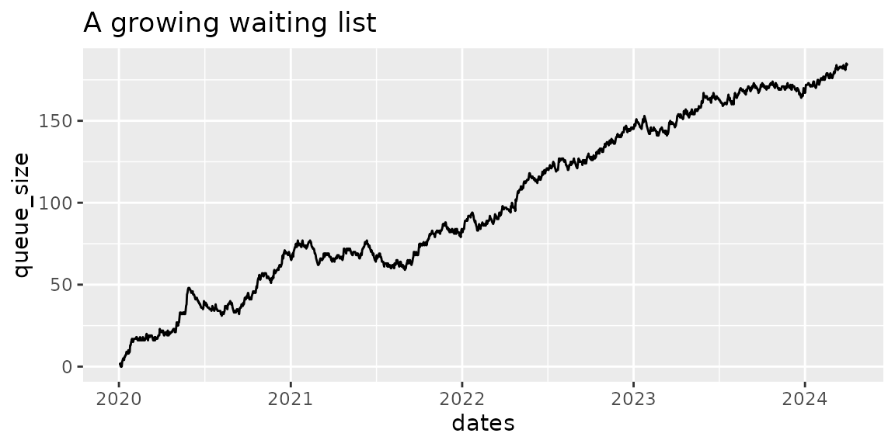
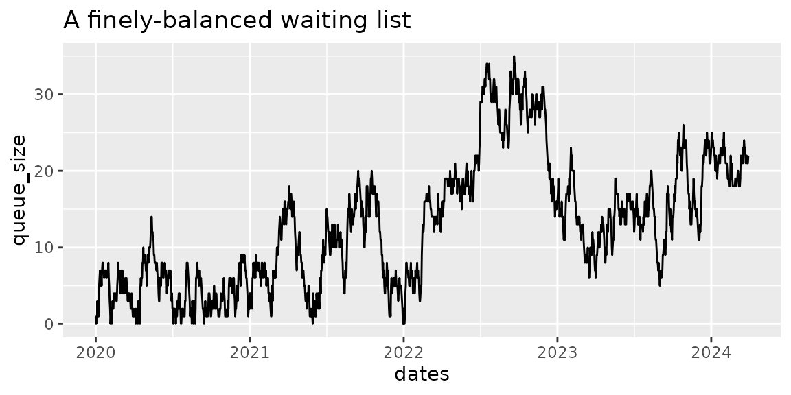
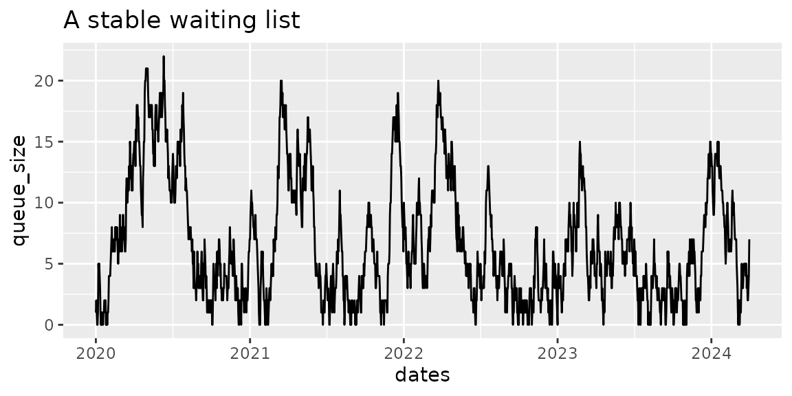

# Three example waiting lists

``` r

library(NHSRwaitinglist)
library(ggplot2)
library(dplyr, warn.conflicts = FALSE)

# set a seed so that these plots are always the same
set.seed(2)
```

This vignette is a set of worked examples using a sample dataset similar
to that which you may be working with. It also demonstrates how to use
the `wl_*` family of functions, such as `wl_simulator`, `wl_queue_size`,
`wl_referral_stats`, `wl_removal_stats`, and `wl_stats`.

## Anatomy of a waiting list

In its purest form, a waiting list consists of the dates that
individuals arrived in a queue, and the dates that they left having been
seen by the service (doctor, nurse, or diagnostic test, and so on).
These dates are the waiting list additions (or arrivals, referrals), and
waiting list removals (or treatments, discharges). They correspond to
demand (for arrivals), and capacity (for removals).

This vignette is going to simulate 3 different waiting lists:

1.  [A list where demand is higher than capacity](#one)
2.  [A list where demand and capacity are similar](#two)
3.  [A list where there is sufficient capacity for the demand](#three)

## 1. A growing waiting list

[Back to top…](#)

So first we need a waiting list, and we can make a synthetic one using
the
[`wl_simulator()`](https://nhs-r-community.github.io/NHSRwaitinglist/reference/wl_simulator.md)
function. We decide how long our simulation should run for, and what our
weekly demand and capacity is. In the example below the capacity is less
than the demand, so over time we should expect a queue to form.

``` r

waiting_list <- wl_simulator(
  start_date = "2020-01-01",
  end_date = "2024-03-31",
  demand = 10, # simulating 10 patient arrivals per week
  capacity = 9 # simulating 9 patients being treated per week
)

head(waiting_list, 10)
#>      Referral    Removal
#> 1  2020-01-02 2020-01-03
#> 2  2020-01-03 2020-01-04
#> 3  2020-01-04 2020-01-05
#> 4  2020-01-04 2020-01-05
#> 5  2020-01-06 2020-01-07
#> 6  2020-01-08 2020-01-09
#> 7  2020-01-08 2020-01-10
#> 8  2020-01-08 2020-01-11
#> 9  2020-01-09 2020-01-12
#> 10 2020-01-09 2020-01-12
```

Now that we have a waiting list, we should visualise it. We can use the
[`wl_queue_size()`](https://nhs-r-community.github.io/NHSRwaitinglist/reference/wl_queue_size.md)
function to tell us the size of the queue at the end of each day. We can
use {ggplot} to make a plot of the queue size over time, and as
expected, it gets larger and larger because our demand is bigger than
our capacity.

``` r

# calculate the queue size
queue_size <- wl_queue_size(waiting_list)

head(queue_size)
#>        dates queue_size
#> 1 2020-01-02          1
#> 2 2020-01-03          1
#> 3 2020-01-04          2
#> 4 2020-01-05          0
#> 5 2020-01-06          1
#> 6 2020-01-07          0

tail(queue_size)
#>           dates queue_size
#> 1546 2024-03-26        182
#> 1547 2024-03-27        181
#> 1548 2024-03-28        183
#> 1549 2024-03-29        185
#> 1550 2024-03-30        184
#> 1551 2024-03-31        185

# visualise the queue with a plot
ggplot(queue_size, aes(dates, queue_size)) +
  geom_line() +
  labs(
    title = "A growing waiting list"
  )
```



### Referral statistics

Next, we might be interested in some statistics about the referrals, or
arrivals, to the queue. We can use the
[`wl_referral_stats()`](https://nhs-r-community.github.io/NHSRwaitinglist/reference/wl_referral_stats.md)
function to calculate these.

``` r

referral_stats <- wl_referral_stats(waiting_list)

head(referral_stats)
#>   demand_weekly demand_daily demand_cov demand_count
#> 1      9.818065     1.402581   1.131775         2174
```

Now we can see that 2174 patients joined our simulated waiting list, at
an average rate of 9.82 per week, or 1.4 per day. Very close to the 10
patients a week we requested when we made our simulated waiting list
using
[`wl_simulator()`](https://nhs-r-community.github.io/NHSRwaitinglist/reference/wl_simulator.md).
The final statistic of interest is the coefficient of variation, which
is 1.13.

### Removal statistics

Similarly, we might be interested in some statistics about the removals
from the queue. We can use the
[`wl_removal_stats()`](https://nhs-r-community.github.io/NHSRwaitinglist/reference/wl_removal_stats.md)
function to calculate these.

``` r

removal_stats <- wl_removal_stats(waiting_list)

head(removal_stats)
#>   capacity_weekly capacity_daily capacity_cov removal_count
#> 1        9.001294       1.285899    0.5363836          1988
```

Now we can see that 1988 patients were treated and removed from our
simulated waiting list, at an average rate of 9 per week, or 1.29 per
day. Very close to the 9 patients a week we set up using
[`wl_simulator()`](https://nhs-r-community.github.io/NHSRwaitinglist/reference/wl_simulator.md).
The final statistic of interest is the coefficient of variation (for
removals), which is 0.54.

### Overall stats

Finally, we can calculate a combined set of statistics to summarise the
waiting list. To do this we need to provide the target waiting time.
This might be 2 weeks for a cancer referral, or commonly 18 weeks for a
standard non-cancer referral.

``` r

overall_stats <- wl_stats(
  waiting_list = waiting_list,
  target_wait = 18 # standard NHS 18 weeks target
)

head(overall_stats)
#>   mean_demand mean_capacity     load load_too_big count_demand queue_size
#> 1    9.818065      9.001294 1.090739         TRUE         2174        185
#>   target_queue_size queue_too_big mean_wait cv_arrival cv_removal
#> 1          44.18129          TRUE  64.63784   1.131775  0.5363836
#>   target_capacity relief_capacity pressure
#> 1              NA        15.23417 7.181982
```

This gives us a lot of useful information. Taking it step by step:

The first 4 columns tell us whether the load is larger than 1. If it is,
we can expect the queue to continue growing indefinitely.

| mean_demand | mean_capacity |   load   | load_too_big |
|:-----------:|:-------------:|:--------:|:------------:|
|  9.818065   |   9.001294    | 1.090739 |     TRUE     |

The next columns tell us about the resulting queue size at the end of
our simulation, the target size we need to plan for in order to achieve
the 18 week waiting target, and a judgement about whether the queue is
too large. If the queue is too large, we need to implement some relief
capacity to bring it within range before attempting to maintain the
queue.

| queue_size | target_queue_size | queue_too_big | mean_wait |
|:----------:|:-----------------:|:-------------:|:---------:|
|    185     |     44.18129      |     TRUE      | 64.63784  |

There is a column to report the actual average patient waiting time,
which is 64.64 weeks, compared to our target of 18 weeks.

| mean_wait |
|:---------:|
| 64.63784  |

These two columns re-state the coefficients of variance for use in
reporting.

| cv_arrival | cv_removal |
|:----------:|:----------:|
|  1.131775  | 0.5363836  |

The next two columns tell us about the required capacity. Only one will
contain data.

1.  If the queue is not too large, `"target_capacity"` will report the
    capacity required to maintain the queue at it’s target waiting time
    performance.
2.  If the queue is too large, `"relief_capacity"` will report the
    capacity required to bring the queue to a maintainable size within
    26 weeks (6 months).

| target_capacity | relief_capacity |
|:---------------:|:---------------:|
|       NA        |    15.23417     |

The final column reports the waiting list `"pressure"`. This will be
useful later when comparing waiting lists of differing sizes, with
differing targets. It allows waiting list pressures to be compared
because the waiting list with the largest number of patients waiting is
not always the list with the largest problem meeting its target.

| pressure |
|:--------:|
| 7.181982 |

## 2. A finely balanced waiting list

[Back to top…](#)

The waiting list in this section is very finely balanced. The demand
remains the same as the last example, but now capacity has been
increased to be slightly larger than demand. It is not significantly
larger (there is approximately 2% `"spare"`).

``` r

waiting_list <- wl_simulator(
  start_date = "2020-01-01",
  end_date = "2024-03-31",
  demand = 10, # simulating 10 patient arrivals per week
  capacity = 10.2 # simulating 10.2 patients being treated per week
)

referral_stats <- wl_referral_stats(waiting_list)
head(referral_stats)
#>   demand_weekly demand_daily demand_cov demand_count
#> 1      10.10458     1.443512   1.153809         2236

removal_stats <- wl_removal_stats(waiting_list)
head(removal_stats)
#>   capacity_weekly capacity_daily capacity_cov removal_count
#> 1        10.12941       1.447059    0.6896719          2214

# calculate the queue size
queue_size <- wl_queue_size(waiting_list)
```

This time we processed 2214 patients.

The increase in capacity not only allowed processing more patients, it
also changed the shape of the queue. Visualising the queue we can see
that this time it did not grow uncontrollably, reaching a maximum size
of 35 patients waiting over the same time period as the first
simulation. It also returned to zero length several times during the
simulated period.

``` r

# visualise the queue with a plot
ggplot(queue_size, aes(dates, queue_size)) +
  geom_line() +
  labs(
    title = "A finely-balanced waiting list"
  )
```



This time we will go straight to calculating the overall statistics.

``` r

overall_stats <- wl_stats(
  waiting_list = waiting_list,
  target_wait = 18 # standard NHS 18wk target
)

head(overall_stats)
#>   mean_demand mean_capacity      load load_too_big count_demand queue_size
#> 1    10.10458      10.12941 0.9975489        FALSE         2236         22
#>   target_queue_size queue_too_big mean_wait cv_arrival cv_removal
#> 1          45.47063         FALSE  6.863636   1.153809  0.6896719
#>   target_capacity relief_capacity  pressure
#> 1        10.30535              NA 0.7626263
```

In this finely balanced example, the mean demand and mean capacity give
a load very close to 1, at 0.9975. While this is less than one, it is
perhaps a little too close for comfort.

We can see that the finishing queue size is 22, but as discussed above,
the waiting list fluctuated in size, and even returned to zero a couple
of times during the simulated period. It has not grown uncontrollably as
in the first example.

The mean wait is 6.86, which is less than the target of 18 weeks, but is
more than a quarter of the target. The exponential shape of waiting list
distributions means that in this system we would expect more than a
reasonable number of patients to be experiencing waiting times of over
18 weeks.

This time, we do not need relief capacity because the queue is not too
big. Instead, the package recommends a `"target capacity"`, which we
need to provide if we want to meet the 18 week standard for the right
proportion of patients. In this case it is 10.305, which is only very
marginally larger than the mean capacity we have available (10.129).

## 3. A waiting list with sufficient capacity

[Back to top…](#)

The final example is for a waiting list with sufficient capacity to meet
demand. We’ll use the recommended figure from the example above,
assuming we have made some improvements and increased available capacity
from 10.2 to 10.3 patients per week.

``` r

waiting_list <- wl_simulator(
  start_date = "2020-01-01",
  end_date = "2024-03-31",
  demand = 10, # simulating 10 patient arrivals per week
  capacity = 10.3 # simulating 10.3 patients being treated per week
)

referral_stats <- wl_referral_stats(waiting_list)
head(referral_stats)
#>   demand_weekly demand_daily demand_cov demand_count
#> 1      9.698904     1.385558   1.173034         2149

removal_stats <- wl_removal_stats(waiting_list)
head(removal_stats)
#>   capacity_weekly capacity_daily capacity_cov removal_count
#> 1        10.14005       1.448579    0.7247564          2141

# calculate the queue size
queue_size <- wl_queue_size(waiting_list)
```

This time we processed 2141 patients.  
Visualising the queue, again it looks different to the previous
examples. While the maximum number of patients in the queue is similar
to the last example, this time the queue size has frequently dropped to
zero. This is a stable queue, which is able to empty more regularly.

**NOTE** When the queue is empty, the process serving it will also be
idle. Conventional wisdom has it that at this point the process must
have excess capacity, which can safely be removed. This is **not** the
case. Returning to “Fact 2” of [Professor Neil Walton’s white
paper](https://www.medrxiv.org/content/10.1101/2022.08.23.22279117v1.full),

> If you want to have low waiting times, then there must be a
> non-negligible fraction of time where services are not being used.

``` r

# visualise the queue with a plot
ggplot(queue_size, aes(dates, queue_size)) +
  geom_line() +
  labs(
    title = "A stable waiting list"
  )
```



Again calculating the overall statistics.

``` r

overall_stats <- wl_stats(
  waiting_list = waiting_list,
  target_wait = 18 # standard NHS 18 weeks target
)

head(overall_stats)
#>   mean_demand mean_capacity      load load_too_big count_demand queue_size
#> 1    9.698904      10.14005 0.9564943        FALSE         2149          7
#>   target_queue_size queue_too_big mean_wait cv_arrival cv_removal
#> 1          43.64507         FALSE 0.8571429   1.173034  0.7247564
#>   target_capacity relief_capacity  pressure
#> 1        9.910157              NA 0.0952381
```

This time the simulation has created a mean demand and capacity which is
slightly lower than we asked for, but the gap between them is similar to
what we wanted.

The load comes out at 0.956, which is more comfortably below one. A
still lower load would give more headroom, and may even become necessary
if the variability of demand or capacity were to increase.

The mean wait is 0.86, less than a week, which is very comfortably less
than the target of 18 weeks. In this system we expect the 18 weeks
target to be met for the vast majority of patients.

Again, the package is recommending a `"target capacity"`, this time of
9.91, which is a similar margin above the mean demand for this
simulation (9.699).

## Conclusion

[Back to top…](#)

This vignette has detailed some of the `wl_*` functions you can use to
explore your waiting list performance. We also saw how altering service
capacity without changing demand can have a dramatic effect on the
behaviour of a waiting list.

------------------------------------------------------------------------

END
